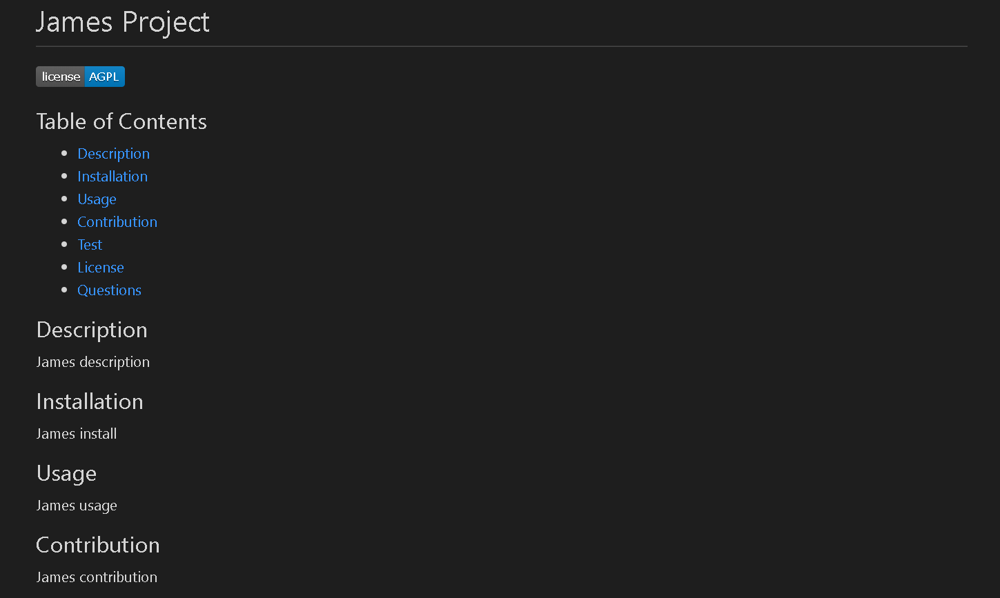

# README-Generator
application demo: https://drive.google.com/file/d/1aEefplS9pczHtr3KR0sKjFbMHmMXKMjS/view  
 
James Merges  
email: jamesmerges1@gmail.com  
github: https://github.com/jmerges  
linkedin: https://www.linkedin.com/in/james-merges-b938401b7/  
## Description
This application prompts the user for input and constructs a README.md file based on the response.
## Technology
I used javascript and the inquirer package with node.js to creat this application.
## Preview
